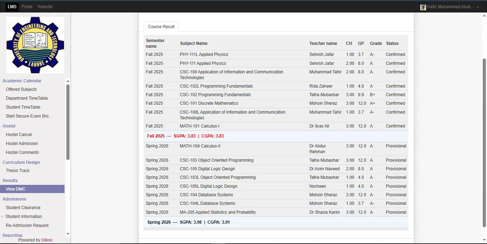
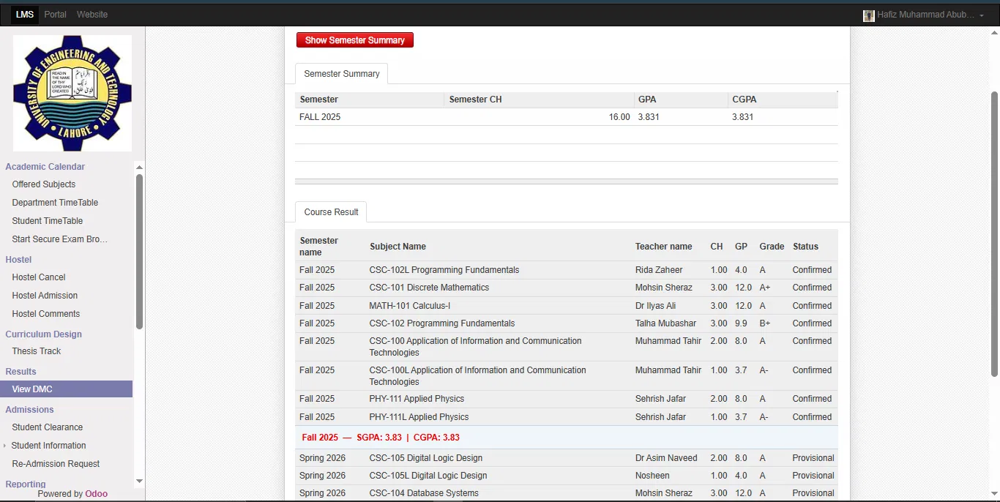
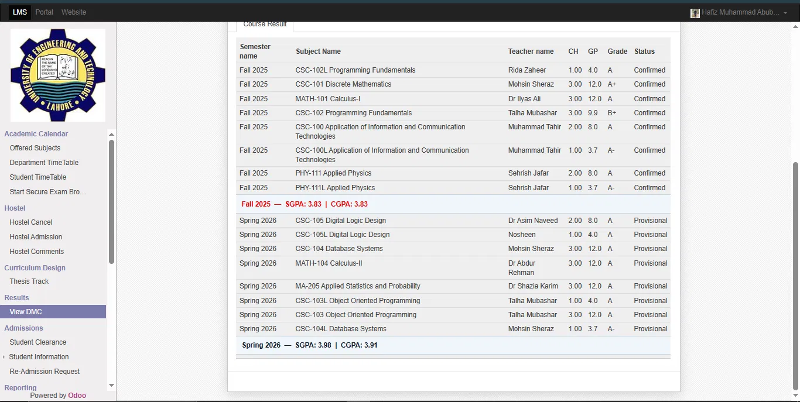

# UET LMS - SGPA & CGPA Auto Calculator

A Tampermonkey userscript that automatically calculates and displays **SGPA** (per semester) and running **CGPA** directly inside the **Student DMC** page on [UET LMS](https://lms.uet.edu.pk/) — no more manual calculation with a calculator or Excel sheet.

---

## ✨ Features

- 📊 **Automatic SGPA calculation** for every semester, based on Credit Hours (CH) and Grade Points (GP)
- 📈 **Running CGPA** shown after every semester, cumulative up to that point
- 🧩 **Dynamically detects table columns** — works even if UET LMS changes the column order
- 🔄 **Self-healing** — if the page reorders or re-renders the table (e.g. after clicking **"Show Semester Summary"**), the script automatically re-groups everything correctly again
- 🎨 **Color-coded results**:
  - 🔴 **Red** — semester fully **Confirmed**
  - ⚫ **Black** — semester still **Provisional** / in progress
- ⚡ Lightweight — no external dependencies, pure JavaScript
- 🔁 **Auto-updates** automatically when a new version is published (via Tampermonkey's update mechanism)

---

## 📸 Screenshots

**Semester results with SGPA/CGPA line automatically inserted after each semester:**

**Still works correctly even after clicking "Show Semester Summary" (which normally shuffles the table):**

**Close-up of the semester summary line:**

> *(These images should be uploaded directly to the root of this repository with the exact filenames `demo1.png`, `demo2.png`, and `demo3.png`.)*

---

## 📥 Installation

### Step 1 — Install Tampermonkey
If you don't already have it, install the Tampermonkey browser extension:
- [Chrome](https://chromewebstore.google.com/detail/tampermonkey/dhdgffkkebhmkfjojejmpbldmpobfkfo)
- [Firefox](https://addons.mozilla.org/en-US/firefox/addon/tampermonkey/)
- [Edge](https://microsoftedge.microsoft.com/addons/detail/tampermonkey/iikmkjmpaadaobahmlepeloendndfphd)

### Step 2 — Install the script
Click the link below, then hit **Install** on the Tampermonkey confirmation page:

👉 **[Install UET LMS SGPA/CGPA Calculator](https://raw.githubusercontent.com/abubakar7997218-wq/Gpa-Cgpa-Extension/main/uet-lms-sgpa-cgpa.user.js)**

### Step 3 — Enable "Allow User Scripts" (Chrome only, one-time setup)
Recent versions of Chrome require this extra permission:
1. Go to `chrome://extensions`
2. Click **Details** on Tampermonkey
3. Turn on **"Allow User Scripts"**

### Step 4 — Use it
1. Log in to [UET LMS](https://lms.uet.edu.pk/)
2. Go to **Results → View DMC**
3. The SGPA/CGPA lines will appear automatically after each semester's subjects

---

## ⚙️ How It Works

1. The script scans the page for the **Course Result** table and identifies the `Semester`, `CH` (Credit Hours), `GP` (Grade Points), and `Status` columns dynamically — regardless of their order.
2. It groups all subject rows by semester (even if UET LMS displays them out of order).
3. For each semester, it computes:
   - **SGPA** = (Sum of GP in that semester) ÷ (Sum of CH in that semester)
   - **CGPA** = (Sum of GP so far) ÷ (Sum of CH so far) — cumulative across all semesters up to that point
4. A summary line is inserted right after each semester's last subject, colored **red** if all subjects in that semester are `Confirmed`, or **black** if the semester is still `Provisional`.
5. A `MutationObserver` continuously watches the page. If UET LMS re-renders or reorders the table (e.g. after clicking "Show Semester Summary"), the script automatically detects the change and re-applies the grouping and calculations.

---

## 🔄 Updating

This script uses Tampermonkey's built-in auto-update mechanism (`@updateURL` / `@downloadURL`). Once installed, it will automatically fetch new versions whenever this repository is updated — no manual reinstallation needed.

To manually force an update check:
1. Open Tampermonkey Dashboard
2. Go to **Utilities**
3. Click **"Check for userscript updates"**

---

## ⚠️ Disclaimer

This script only **reads and displays** data that is already visible on your own UET LMS Student DMC page. It does not modify, submit, or transmit any data anywhere. Use at your own discretion — always verify official results directly on UET LMS.

---

## 📄 License

Free to use, modify, and share.
